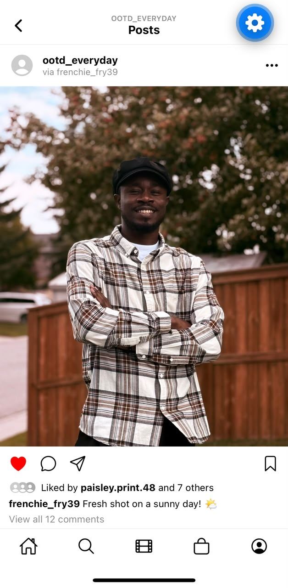

# OOTD Everyday — Instagram Post UI Clone

A React Native (Expo) recreation of an Instagram single-post screen, built for CPRG303 — Building a Mobile UI with Expo and React Native.

## Screen Recreated

The "Posts" detail view — profile header, post photo, engagement icons, likes, caption, and comments, styled to match the assignment's sample snapshot with a custom photo swapped in.



## Features Implemented

- Custom nav bar (back icon, centered title stack)
- Post header (avatar, username, options icon)
- Full-width post image
- Icon row (like, comment, share, bookmark)
- Overlapping avatar stack + likes count
- Caption with bold username
- Comments section with "view all" link
- Scrollable content area with a fixed bottom tab bar
- Runs on both iOS and Android via Expo Go

## Tech Stack

- React Native + Expo (SDK 57)
- TypeScript
- Expo Router (file-based navigation)
- `@expo/vector-icons` (Ionicons)

## Running the Project

```bash
npm install
npx expo start --tunnel
```

Scan the QR code with the **Expo Go** app on your phone.

## Project Structure

Main screen: `src/app/index.tsx`
Layout / navigation config: `src/app/_layout.tsx`

## Contributors

- Vincent (Ebube Okutalukwe)
